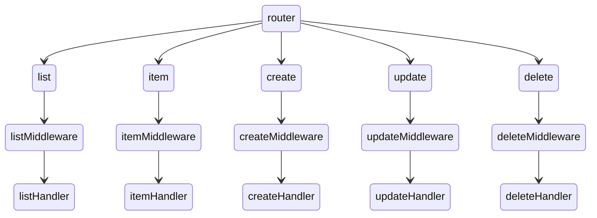

# GoingMerry

> 黄金梅里号

#### [接口文档](https://documenter.getpostman.com/view/23491030/2s9YRGwUQK)

#### [线上地址](http://120.25.247.55/home)

#### [前端仓库地址](https://github.com/leslieXin92/ThousandSunny)

## ~~一些废话~~

此项目为个人网站后端，于``2023-07-24``立项，命名为``黄金梅里号``
，灵感来自于海贼王。梅里号是承载草帽海贼团的第一艘船，后因难以修补被废弃，但优秀的Franky还是将梅里号的意志保留了下来，转接到了``万里阳光号``
中。万里阳光号见证了草帽海贼团一路的成长，其背后也有黄金梅里号的意念，在一直为他们保驾护航。

## 技术选型

- [koa2](https://github.com/koajs/koa)、[koa-router](https://github.com/ZijianHe/koa-router)、[koa-multer](https://github.com/koa-modules/multer)、[koa-static](https://github.com/koajs/static)、[koa2-cors](https://github.com/zadzbw/koa2-cors)
  来搭建Web服务
- [TypeScript](https://www.typescriptlang.org)作为开发语言，[module-alias]()来实现项目alias
- [mysql2](https://github.com/sidorares/node-mysql2)
  来实现数据库通信，[jsonwebtoken](https://www.npmjs.com/package/jsonwebtoken)实现token颁发及校验
- [jest](https://github.com/jestjs/jest)实现case测试，[supertest](https://github.com/ladjs/supertest)模拟接口请求

## 结构



## ~~引以为傲~~

1. 封装useReturn来统一接口返回的数据结构

 ```typescript
export const useReturn = <Data = {}>(code: number, data: Data, msg: string) => {
  return { code, data, msg }
}

export const useSuccessReturn = <R = unknown>(result: R, message?: string) => {
  return useReturn(0, result ?? {}, message || 'Success!')
}

export const useErrorReturn = (message: string) => {
  return useReturn(1, {}, message)
}
```

2. 错误捕获处理机制

 ```typescript
  // global error emitter
export const throwError = (ctx: Context, errorMsg: string, errorStatus: number = 500) => {
  ctx.errorStatus = errorStatus
  ctx.app.emit('error', new Error(errorMsg), ctx)
}

// global error handler
export const errorHandler = (error: Error, ctx: Context) => {
  ctx.status = ctx.errorStatus || 500
  ctx.body = useErrorReturn(error.message)
}
```

3. jest封装

 ```typescript
import request from 'supertest'
import { sign } from 'jsonwebtoken'
import app from '@/app'
import { queryInsert } from '@/utils'
import { PRIVATE_KEY } from '@/app/config'
import type { Test } from 'supertest'
import type { UserInfo } from '@/types'

type Method = 'get' | 'GET' | 'post' | 'POST' | 'patch' | 'PATCH' | 'delete' | 'DELETE'

const handleAuth = async (req: Test, userInfo: Omit<UserInfo, 'password'>) => {
  await queryInsert({
    table: 'users',
    data: {
      ...userInfo,
      password: 'test'
    }
  })
  const token = sign(userInfo, PRIVATE_KEY, {
    expiresIn: 60 * 60 * 24,
    algorithm: 'RS384'
  })
  req.set('Authorization', token)
}

export const useTest = <Params = unknown>(url: string, method: Method, params?: Params) => {
  switch (method) {
    case 'get' || 'GET':
      return async (data: Partial<Params> = params ?? {}, userInfo?: Omit<UserInfo, 'password'>) => {
        const req = request(app.callback()).get(url).query(data ?? params ?? {})
        if (userInfo) await handleAuth(req, userInfo)
        return req
      }

    case 'post' || 'POST':
      return async (data: Partial<Params> = params ?? {}, userInfo?: Omit<UserInfo, 'password'>) => {
        const req = request(app.callback()).post(url).send(data ?? params ?? {})
        if (userInfo) await handleAuth(req, userInfo)
        return req
      }

    case 'patch' || 'PATCH':
      return async (data: Partial<Params> = params ?? {}, userInfo?: Omit<UserInfo, 'password'>) => {
        const req = request(app.callback()).patch(url).send(data ?? params ?? {})
        if (userInfo) await handleAuth(req, userInfo)
        return req
      }

    case 'delete' || 'DELETE':
      return async (data: Partial<Params> = params ?? {}, userInfo?: Omit<UserInfo, 'password'>) => {
        const req = request(app.callback()).delete(url).send(data ?? params ?? {})
        if (userInfo) await handleAuth(req, userInfo)
        return req
      }

    default:
      return async (data: Partial<Params> = params ?? {}, userInfo?: Omit<UserInfo, 'password'>) => {
        const req = request(app.callback()).get(url).query(data ?? params ?? {})
        if (userInfo) await handleAuth(req, userInfo)
        return req
      }
  }
}
```

4. sql封装

```typescript
type Table = 'users' | 'blogs' | 'projects' | 'tasks' | 'files'

interface SelectQuery {
  table: Table,
  where?: Record<string, any>,
  columns: string[]
}

interface InsertQuery {
  table: Table,
  data: Record<string, any>
}

interface UpdateQuery {
  table: Table,
  where: Record<string, any>,
  update: Record<string, any>
}

interface DeleteQuery {
  table: Table,
  where: Record<string, any>
}

export const querySelect = async <T = unknown>(query: SelectQuery) => {
  const { table, where = {}, columns } = query
  const whereClause = Object.keys(where).length > 0
    ? `WHERE ${Object.keys(where).map(key => `${key} = ?`).join(' AND ')}`
    : ''
  const statement = `
    SELECT ${columns.join(',')}
    FROM ${table}
    ${whereClause}
 `
  const res = await execute(statement, Object.values(where))
  return res[0] as unknown as Promise<T>
}

export const queryInsert = async (query: InsertQuery) => {
  const { table, data } = query
  const keys = Object.keys(data)
  const values = Object.values(data)
  const statement = `
    INSERT INTO ${table}
    (${keys.join(',')}) VALUES (${keys.map(() => '?').join(',')})
  `
  await execute(statement, values)
}

export const queryUpdate = async (query: UpdateQuery) => {
  const { table, where, update } = query
  const statement = `
    UPDATE ${table}
    SET ${Object.keys(update).map(key => `${key} = ?`).join(',')}
    WHERE ${Object.keys(where).map(key => `${key} = ?`).join(' AND ')}
  `
  await execute(statement, [...Object.values(update), ...Object.values(where)])
}

export const queryDelete = async (query: DeleteQuery) => {
  const { table, where } = query
  const statement = `
    DELETE FROM ${table}
    WHERE ${Object.keys(where).map(key => `${key} = ?`).join(' AND ')}
  `
  await execute(statement, Object.values(where))
}
```
